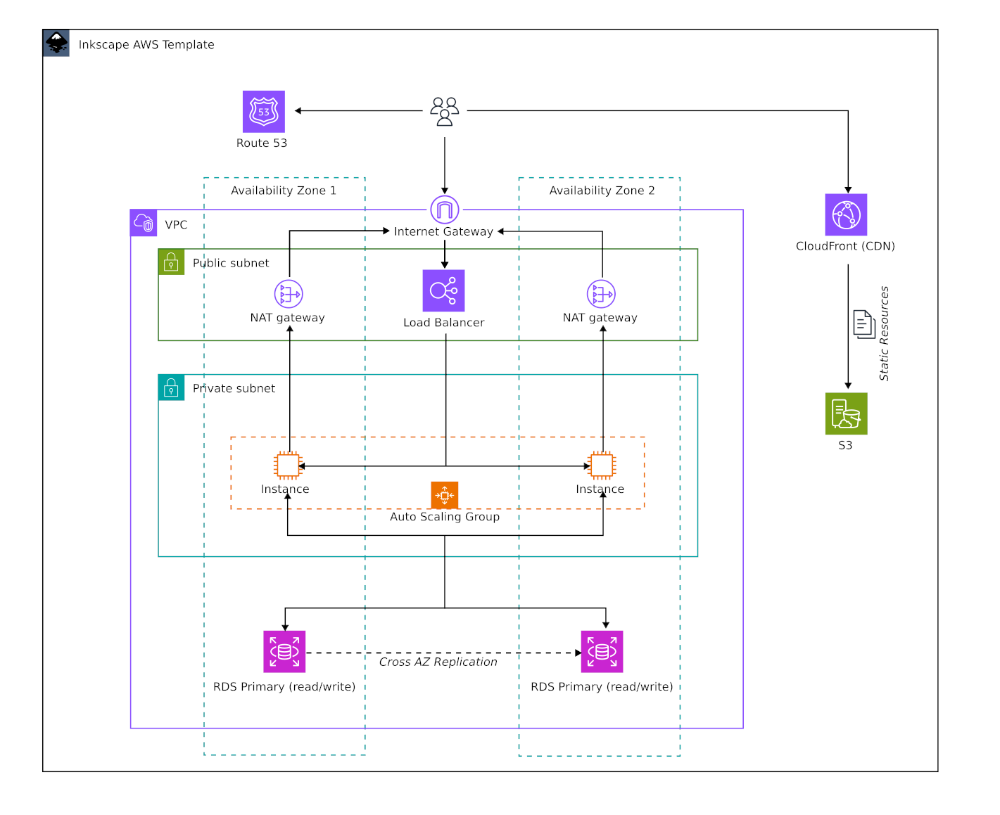
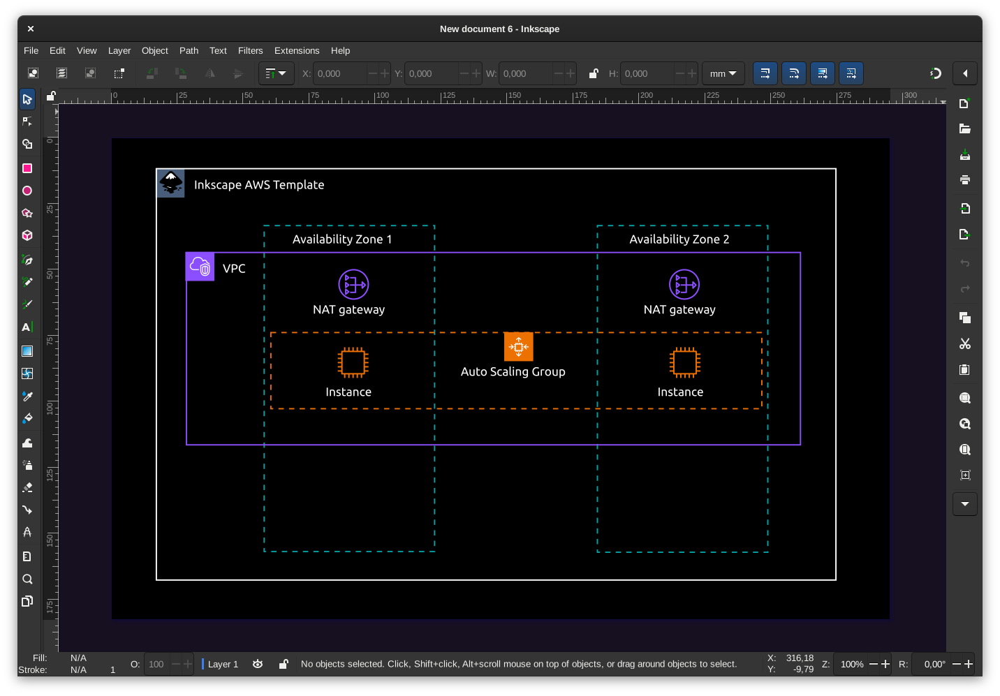

# Inkscape Cloud Architect

_We can do better than all that expensive online crap editors_ 😎

Make Inkscape a professional Cloud Visualization Studio for Cloud Architects.

## Includes

- AWS Symbol Sets
- AWS Diagram Templates
- AWS Auto Diagram Extension






## Install

Clone repo. Build symbols and install all assets (symbols, templates, extension) to the current user's Inkscape folder.

```
git clone https://github.com/mipmip/inkscape-cloud-architect
cd inkscape-cloud-architect
./RUNME.sh all
```

Install individual deliverables:

```
./RUNME.sh symbols_build      # Build SVG symbols from AWS asset zip
./RUNME.sh symbols_install    # Install symbols to Inkscape
./RUNME.sh templates_install  # Install templates to Inkscape
./RUNME.sh extension_install  # Install extension to Inkscape
```

## Remove

Remove all installed assets:

```
./RUNME.sh clean
```

Remove awslabs repo cache (separate, slow to rebuild):

```
./RUNME.sh symbols_clean_cache
```

## Usage

### Using templates

Click `New from template` in File menu and search for `AWS`.

### Using Symbols

Open the symbols tab and select an AWS panel. You can also select all symbols
and then search for specific AWS symbols. Eg. `NAT`.

### 💡 Tips for diagramming with Inkscape

Inkscape is a vector drawing application which can have many purposes. Read these tips to [optimize your Inkscape workflow](docs/tips.md) for creating Cloud Diagrams.

## Future

- Connect to AWS to visialize live cloud environments.
- Instance Types
- Azure
- better dark mode supprt
- Install scripts for Windows

## Disclaimer

Icons are downloaded from AWS and AWS is copyright owner of these icons.

_sponsored by [TechNative](https://technative.eu)_
